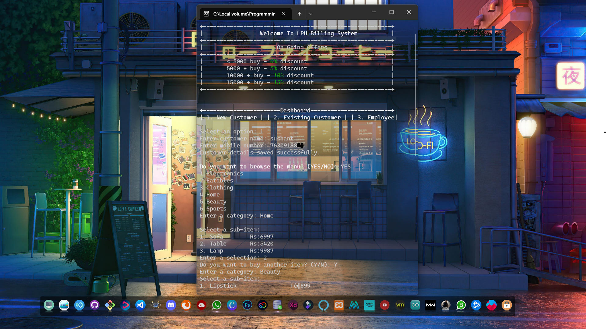
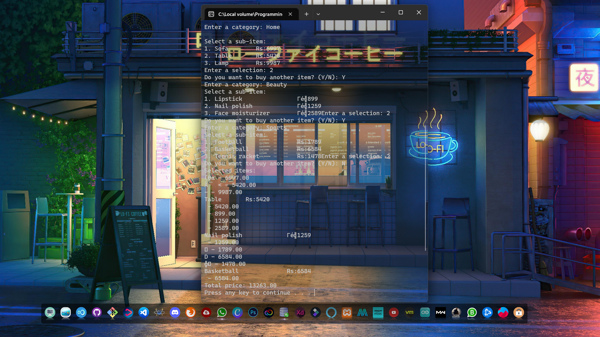

# LPU Billing System

  
  

## Description

LPU Billing System is a simple command-line billing system written in C. It provides basic functionalities for managing customer details, handling billing, and browsing the menu of available items. The system offers discounts based on the total purchase amount.

### C Concepts Used

- **Preprocessor Directives**: The project uses preprocessor directives, such as `#include` to include necessary header files (`stdio.h`, `stdlib.h`, etc.), and `#define` to define constants (`MAX_CUSTOMER_NAME`, `MAX_MOBILE_NUMBER`, etc.).

- **Standard Input/Output (stdio.h)**: The `printf` and `scanf` functions are used for input and output operations, allowing users to interact with the system through the command-line interface.

- **File Handling (stdio.h)**: The project utilizes file handling functions like `fopen`, `fprintf`, and `fclose` to save customer details to a file and read customer information from it.

- **Control Statements**: The software employs conditional statements (`if`, `else if`, `else`) to make decisions based on the user's input (option selection).

- **Loops**: The code includes loops (`for` loop) to convert the input menu selection to uppercase for validation and to iterate over file lines to find an existing customer.

- **Arrays**: Arrays (`char customer_name[100]`, `char mobile_number[20]`, etc.) are used to store and manage customer information and menu selection.

- **Functions**: Functions are used to modularize the code and improve readability. The `clearScreen` function clears the console screen, and `browseMenu` function is a placeholder for implementing the menu functionalities.

## Features

- New Customer Registration: Allows users to register new customers by providing their name and mobile number. The details are stored in a file for future reference.

- Existing Customer Check: Allows users to check if a customer is already registered based on their mobile number. If the customer is found, they are eligible for exclusive offers.

- Billing: Calculates and applies discounts based on the total purchase amount. The ongoing discount offers are displayed on the dashboard.

- Menu Browsing: Users can browse the available menu items and select their desired items for billing.

## How to Use

1. Clone the repository to your local machine.
2. Compile the C code using a C compiler.
3. Run the executable to start the billing system.
4. Follow the on-screen instructions to use the system.

## Requirements

- C Compiler (e.g., GCC)
- Standard C Library
- Operating System: Windows, Linux, or macOS

## Credits

Developed By Sushant ❤
